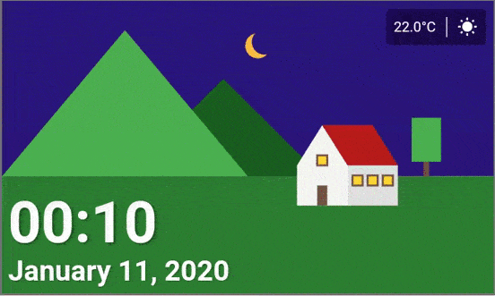
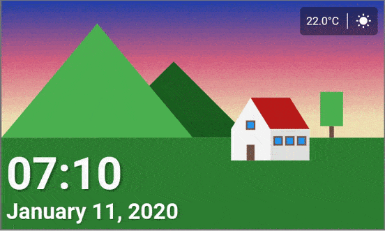
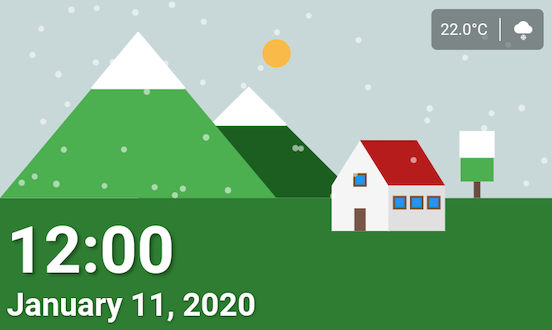
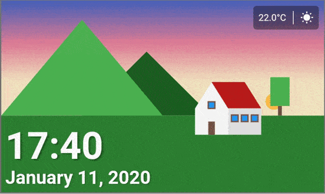
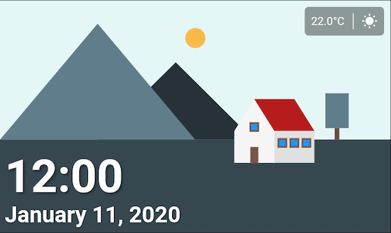
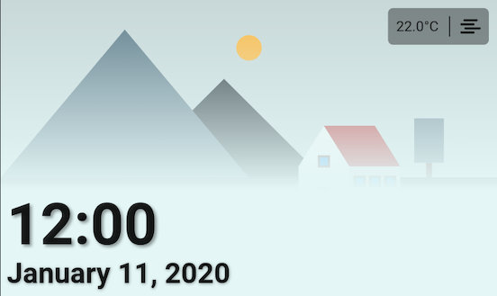

# Digital Clock

This is the submission for the [Flutter Clock Challenge](https://flutter.dev/clock).

The app is a clock face for the Lenovo Smart Clock.

## Design and data notes:

* The ClockModel API with mock data is provided to you. Using this API is optional, but it provides system information such as the brightness mode, weather, and time format.
* The clock design should use landscape mode, with a 5:3 aspect ratio.
* You may use Material Design icons.
* Your Submission’s code must be licensed under an appropriate open source license (for code, BSD aka University of California license, MIT license or Apache 2.0 license are recommended; for assets, CC BY 4.0 license or Apache 2.0 license are recommended; for fonts, OFL license is recommended).
* Your clock should not:
    * Have user interaction (such as tapping, gestures, dragging, mouse, keyboard, and so on).
    * Play audio, including an alarm.
    * Make network requests.
    * Collect data in violation of applicable laws (including privacy laws).
    * Contain copyrighted or trademarked content.

The app has both dark and light themes, and react to weather changes.

Some examples:

Light theme at night:



Light theme at sun rise:



Light theme Snowy: 



Light theme at sun set: 



Dark theme:




And one of my favorites... Misty weather with the dark theme 🥰




## Getting Started

The app works in ios, android and web.

Run:

```bash
flutter channel stable
flutter upgrade

cd digital_clock
flutter create .
flutter run
```

### Prerequisites

* [flutter](https://flutter.dev/docs/get-started/install)

Depending on the device you want to run it: 
 * [iOS](https://flutter.dev/docs/get-started/install/macos#ios-setup)
 * [Android](https://flutter.dev/docs/get-started/install/macos#android-setup) 
 * [Web](https://flutter.dev/web)

## Authors

* **Javire Elízaga** - javier.elizaga@gmail.com
